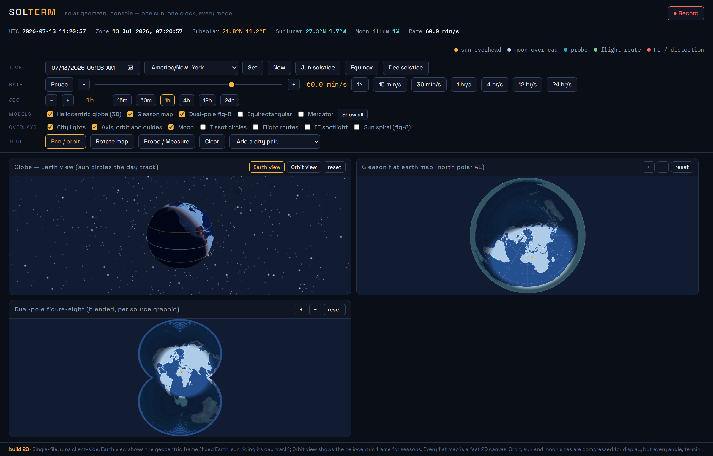

# Solterm

**Solar geometry console — one sun, one clock, every model.**

Solterm drives a single real sun-and-moon ephemeris through a 3D globe and the
common flat-earth map projections, side by side, on one synchronized clock. The
flat-earth constructions are rendered faithfully — the Gleason north-polar map,
the dual-pole figure-eight, a "spotlight" sun a few thousand kilometres up — and
fed the *same* astronomy as the globe, so the places where each model's geometry
diverges from reality become something you can watch rather than argue about.

**Live:** https://icspin.github.io/compare-earfs/

It runs entirely in the browser. No account, no build, nothing to install.

## What you can do

- **Compare models side by side.** Toggle any subset of five views:
  - **Heliocentric globe (3D)** — an *Earth view* (geocentric frame: fixed Earth,
    the sun riding its daily track at the current declination) and an *Orbit view*
    (heliocentric frame that shows why the seasons happen).
  - **Gleason map** — the north-polar azimuthal-equidistant "flat earth" map.
  - **Dual-pole figure-eight** — a bipolar/peanut projection.
  - **Equirectangular** and **Mercator** — the familiar rectangular maps.
- **Scrub time.** Set any date/time in any timezone, jump to the solstices or an
  equinox, jog in fixed steps (15 min to 24 h), or play time forward and back at
  speeds from real-time up to a day per second (and beyond, on the slider).
- **Read the sky at a point.** The **Probe / Measure** tool drops a probe on any
  map or the globe and reports the sun's phase, altitude and azimuth, sunrise and
  sunset, day length, and solar noon, plus two charts: today's sun path, and the
  apparent size a nearby "spotlight" sun would have through the day.
- **Measure across models.** Add a second point (or more, or pick a city pair) and
  the same tool compares the straight-line distance each flat map implies against
  the true great-circle distance a globe gives — with bearings, per-leg breakdowns,
  and a "hours at 900 km/h" column — alongside each location's own sun readout.
- **Overlays.** City lights (NASA night texture), the axis / orbit / tropics /
  circles guides, the moon and its illuminated fraction, Tissot indicatrices,
  editable flight routes, the flat-earth spotlight, and the sun's annual
  figure-eight track.
- **Record** the whole composite to a WebM video, and **open a second window** for
  a clock that stays in sync (via `BroadcastChannel`).

Everything — every angle, terminator, phase and clock — comes from the real
ephemeris. Only the orbit, sun and moon *sizes* are compressed so they fit on
screen.

## Running it

The hosted version above is the easy path. To run your own copy, just open
`index.html` in any modern browser.

One caveat: the 3D globe pulls the three.js library and the night-earth texture
from public CDNs, so the WebGL view needs an internet connection. The 2D maps and
their coastline data are fully inline and work offline.

## How it's built

- A single self-contained `index.html` — no build step, no bundler, no UI
  framework.
- The WebGL globe uses [three.js](https://threejs.org/) (r160), loaded from a CDN
  via an import map.
- Coastlines are an inline JSON block; every flat map is drawn on a fast 2D canvas.
- Astronomy (subsolar/sublunar points, the terminator, twilight bands, moon phase)
  is computed in plain JavaScript from the current timestamp.
- Deployed with GitHub Pages straight from `index.html` at the repo root.

The amber `build N` stamp in the footer marks the current revision.

## License

Released under the [MIT License](LICENSE).
